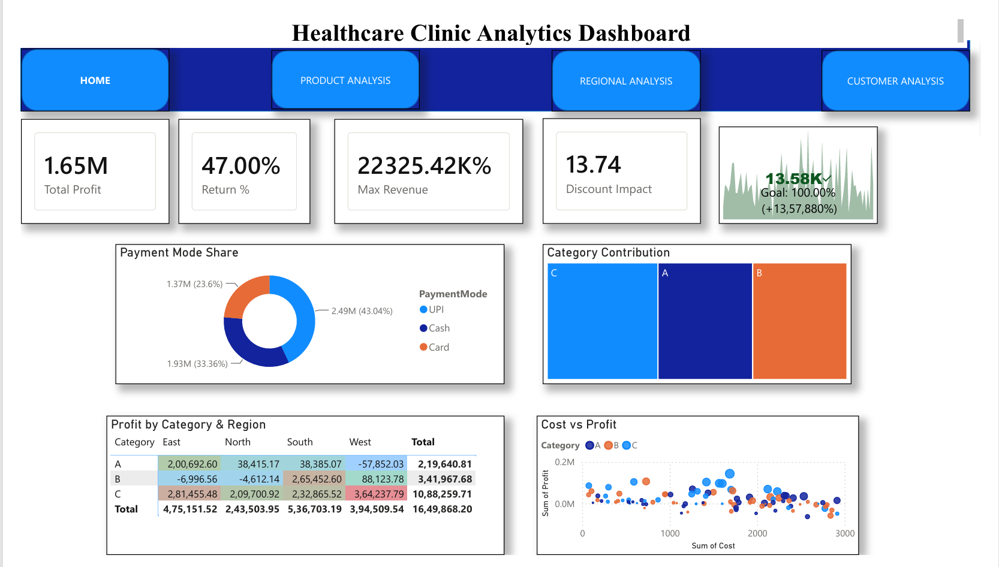
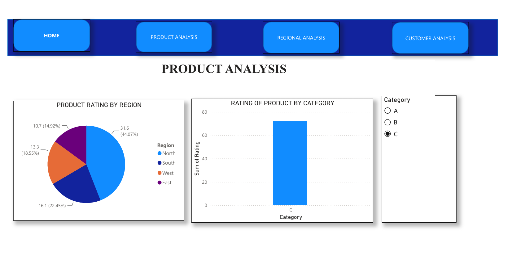
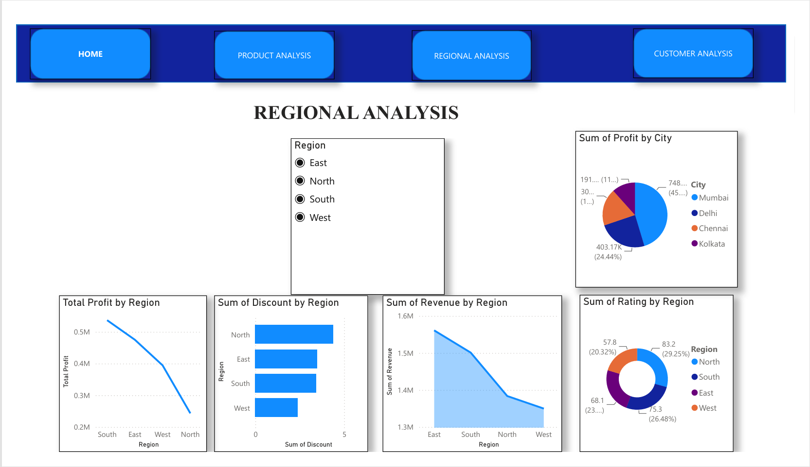
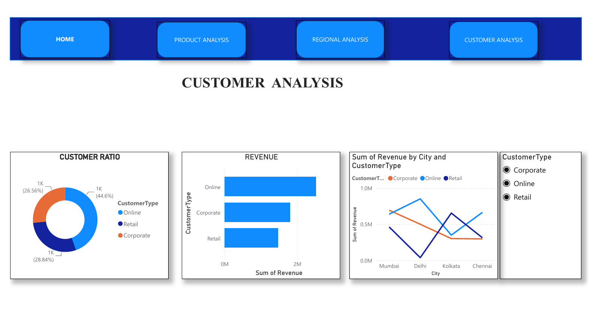

# 🏥 Healthcare Clinic Analytics Dashboard — Power BI

An interactive **Power BI dashboard** built to analyze the performance of a healthcare clinic network — covering profitability, regional performance, product/category trends, and customer behavior. The dashboard turns raw transactional data into clear, decision-ready insights through a clean, multi-page navigation experience.

---

## 📌 Project Overview

This project explores clinic-level business data across **four dimensions** — overall performance, product/category analysis, regional analysis, and customer analysis — to help stakeholders quickly identify what's driving profit, where revenue is concentrated, and how customers engage across payment modes and channels.

The dashboard was designed with a custom navigation bar (**Home | Product Analysis | Regional Analysis | Customer Analysis**) for smooth, report-style exploration, similar to a modern BI application.

---

## 🎯 Key Business Questions Answered

- What is the overall profitability and revenue performance of the clinic network?
- Which product categories (A, B, C) generate the most profit and revenue?
- How does performance vary by region (North, South, East, West) and city (Mumbai, Delhi, Kolkata, Chennai)?
- Which payment modes (UPI, Cash, Card) are customers using most?
- How does revenue break down by customer type (Online, Retail, Corporate)?

---

## 📊 Dashboard Pages

### 1️⃣ Home — Executive Summary
KPI cards for **Total Profit, Return %, Max Revenue, and Discount Impact**, alongside a payment mode breakdown, category contribution treemap, a profit-by-category-and-region matrix, and a cost-vs-profit scatter plot.



### 2️⃣ Product Analysis
Breaks down **product ratings by region** and by category, with an interactive category filter (A / B / C) to drill into performance.



### 3️⃣ Regional Analysis
Compares **profit, revenue, discount, and rating trends across regions**, plus a city-level profit split (Mumbai, Delhi, Chennai, Kolkata), with region slicers for interactive filtering.



### 4️⃣ Customer Analysis
Visualizes the **customer ratio** (Online / Retail / Corporate), revenue by customer type, and a city-by-customer-type revenue trend to highlight channel performance.



---

## 🛠️ Tools & Technologies

| Tool | Purpose |
|---|---|
| **Power BI Desktop** | Dashboard design, data modeling, DAX calculations |
| **Excel (.xlsx)** | Source dataset |
| **DAX** | Custom KPI measures (Profit, Return %, Discount Impact, etc.) |

---

## 📁 Repository Structure

```
├── assets/
│   └── healthcare-clinic-analytics...     # Dashboard preview/cover image
├── screenshots/
│   ├── analysis1.png                      # Home page
│   ├── analysis2.png                      # Product Analysis
│   ├── analysis3.png                      # Regional Analysis
│   └── analysis4.png                      # Customer Analysis
├── case.txt                               # Case study / project brief
├── dataset.xlsx                           # Source dataset
├── healthcare-clinic-analytics-d...       # Power BI (.pbix) dashboard file
└── README.md                              # Project documentation
```

---

## 🔍 Key Insights

- **Category C** is the strongest performer, contributing the largest share of both profit and revenue across nearly all regions.
- **South and West regions** post the highest total profit, while **North** contributes the least, indicating regional performance gaps worth investigating.
- **UPI (43%)** is the dominant payment mode, followed by Cash (33%) and Card (24%) — reflecting a strong digital-payment adoption trend.
- **Online customers** drive the highest revenue share, closely followed by Retail and Corporate, showing a fairly balanced customer mix.
- **Mumbai** leads city-wise profit contribution at ~45%, making it the top-performing location in the network.

---

## 🚀 How to Use

1. Clone this repository
   ```bash
   git clone https://github.com/princetandon80/Healthcare-Clinic-Analytics-Dashboard-PowerBI.git
   ```
2. Open the `.pbix` file in **Power BI Desktop**.
3. Explore the dashboard using the navigation bar and interactive slicers/filters.

---

## 👤 Author

**Prince Tandon**
GitHub: [@princetandon80](https://github.com/princetandon80)
LinkedIn: [@princetandon80](https://www.linkedin.com/in/prince-tandon-193ba437b/?lipi=urn%3Ali%3Apage%3Ad_flagship3_profile_view_base_contact_details%3By2bg%2FfYEQtmprcKPnXKiLA%3D%3D)

---

⭐ If you found this project useful, consider giving the repository a star!